# Project Architecture

This diagram illustrates the high-fidelity, modular service-oriented architecture of the Adrian Cantrill Transcript Automation project. It highlights the separation of infrastructure, platform adaptation, domain orchestration, and data processing.

```mermaid
flowchart TD
    %% Global Styles
    classDef infra fill:#2d3436,stroke:#00cec9,stroke-width:2px,color:#fff,rx:10,ry:10
    classDef domain fill:#2d3436,stroke:#a29bfe,stroke-width:2px,color:#fff,rx:10,ry:10
    classDef platform fill:#2d3436,stroke:#fab1a0,stroke-width:2px,color:#fff,rx:10,ry:10
    classDef logic fill:#2d3436,stroke:#ffeaa7,stroke-width:2px,color:#fff,rx:10,ry:10
    classDef data fill:#2d3436,stroke:#55efc4,stroke-width:2px,color:#fff,shape:cylinder

    subgraph Layer1 [1. INFRASTRUCTURE & CORE]
        direction LR
        ConfigService["fa:fa-gear ConfigService"]:::infra
        BrowserService["fa:fa-globe BrowserService"]:::infra
        Logger["fa:fa-terminal Logger"]:::infra
    end

    subgraph Layer2 [2. PLATFORM ADAPTATION]
        direction TB
        IPlatform["fa:fa-object-group IPlatform (Interface)"]:::platform
        TeachablePlatform["fa:fa-school TeachablePlatform"]:::platform
        TeachablePlatform -- implements --> IPlatform
    end

    subgraph Layer3 [3. AUTOMATION & ORCHESTRATION]
        direction TB
        AutomationCoordinator["fa:fa-microchip AutomationCoordinator"]:::domain
        VideoPlayerController["fa:fa-play-circle VideoPlayerController"]:::domain
    end

    subgraph Layer4 [4. INTERCEPTION & PARSING]
        direction LR
        VttInterceptor["fa:fa-filter VttInterceptor"]:::logic
        VttParser["fa:fa-file-lines VttParser"]:::logic
    end

    subgraph DB [DATA STORAGE]
        Files[("fa:fa-database JSON Manifests<br/>VTT Segments<br/>Final Transcripts")]:::data
    end

    %% Dependencies & Flows
    AutomationCoordinator ==> Layer1
    AutomationCoordinator ==> Layer2
     AutomationCoordinator ==> VideoPlayerController
    
    VideoPlayerController -.-> BrowserService
    
    AutomationCoordinator --> VttInterceptor
    AutomationCoordinator --> VttParser

    VttInterceptor -- captures --> Files
    VttParser -- generates --> Files
    ConfigService -- manages --> Files

    %% Link Styling
    linkStyle default stroke:#636e72,stroke-width:1px,fill:none
    linkStyle 0,1,2,3 stroke:#a29bfe,stroke-width:3px
    linkStyle 7,8 stroke:#55efc4,stroke-width:2px

    %% Subgraph Styling
    style Layer1 fill:#1e272e,stroke:#00cec9,stroke-dasharray: 5 5
    style Layer2 fill:#1e272e,stroke:#fab1a0,stroke-dasharray: 5 5
    style Layer3 fill:#1e272e,stroke:#a29bfe,stroke-width:3px
    style Layer4 fill:#1e272e,stroke:#ffeaa7,stroke-dasharray: 5 5
    style DB fill:#1e272e,stroke:#55efc4,stroke-width:2px
```

### Layer Breakdown
- **Infrastructure**: Low-level services for config, browser management, and logging.
- **Platform Adaptation**: Abstract interfaces and implementations for specific course platforms.
- **Automation & Orchestration**: High-level controllers that drive the browser and coordinate workflows.
- **Interception & Parsing**: Specialized logic for network traffic analysis and WebVTT data cleanup.
