# Project Architecture

This diagram illustrates the module architecture of the Adrian Cantrill Transcript Automation project. The `play` entrypoint spawns isolated `BrowserContext` workers that share session cookies but run fully independently.

```mermaid
flowchart TD
    %% Global Styles
    classDef entry fill:#2d3436,stroke:#a29bfe,stroke-width:2px,color:#fff,rx:10,ry:10
    classDef module fill:#2d3436,stroke:#ffeaa7,stroke-width:2px,color:#fff,rx:10,ry:10
    classDef utility fill:#2d3436,stroke:#00cec9,stroke-width:2px,color:#fff,rx:10,ry:10
    classDef data fill:#2d3436,stroke:#55efc4,stroke-width:2px,color:#fff,shape:cylinder
    classDef worker fill:#2d3436,stroke:#fd79a8,stroke-width:2px,color:#fff,rx:10,ry:10

    subgraph Entrypoints [SRC / ENTRYPOINTS]
        direction LR
        Scrape["fa:fa-magnifying-glass scrape.ts"]:::entry
        Play["fa:fa-play-circle play.ts"]:::entry
    end

    subgraph Workers [PARALLEL WORKERS]
        direction TB
        W1["fa:fa-browser Worker 1\nBrowserContext + Page"]:::worker
        W2["fa:fa-browser Worker 2\nBrowserContext + Page"]:::worker
        WN["fa:fa-browser Worker N\nBrowserContext + Page"]:::worker
    end

    subgraph Logic [HELPERS / FUNCTIONAL]
        direction TB
        Teachable["fa:fa-school teachable.ts"]:::module
        Player["fa:fa-video player.ts"]:::module
        VTT["fa:fa-file-lines vtt.ts"]:::module
        Subtitle["fa:fa-closed-captioning subtitle.ts"]:::module
    end

    subgraph Core [HELPERS / CORE & UTILITY]
        direction LR
        Browser["fa:fa-globe browser.ts"]:::utility
        Config["fa:fa-gear config.ts"]:::utility
        Logger["fa:fa-terminal logger.ts"]:::utility
        Types["fa:fa-code types.ts"]:::utility
    end

    subgraph Storage [DATA STORAGE]
        Files[("fa:fa-database JSON Manifests\nVTT Segments\nFinal Transcripts")]:::data
    end

    %% Scrape Flow
    Scrape ==> Browser
    Scrape ==> Teachable
    Scrape --> Files

    %% Play bootstraps + spawns workers
    Play ==> Browser
    Play ==> Teachable
    Play -- "cookies + queue" --> W1
    Play -- "cookies + queue" --> W2
    Play -- "cookies + queue" --> WN

    %% Each worker uses services
    W1 ==> Player
    W1 ==> VTT
    W1 ==> Subtitle
    W2 ==> Player
    W2 ==> VTT
    W2 ==> Subtitle
    WN -. "same pattern" .-> Player

    %% Utility wiring
    Teachable -.- Config
    Player -.- Logger
    VTT -.-> Files
    VTT -.- Config

    %% Subgraph Styling
    style Entrypoints fill:#1e272e,stroke:#a29bfe,stroke-width:3px
    style Workers fill:#1e272e,stroke:#fd79a8,stroke-width:2px,stroke-dasharray: 5 5
    style Logic fill:#1e272e,stroke:#ffeaa7,stroke-dasharray: 5 5
    style Core fill:#1e272e,stroke:#00cec9,stroke-dasharray: 5 5
    style Storage fill:#1e272e,stroke:#55efc4,stroke-width:2px
```

### Module Breakdown
- **Entrypoints**: The primary CLI scripts (`scrape.ts` and `play.ts`) that orchestrate the automation workflows.
- **Parallel Workers**: Each worker is a self-contained `BrowserContext` + `Page` pair, seeded with the shared login cookies. They pull from a shared lecture queue independently, preventing tab-focus conflicts.
- **Functional Modules**: Grouped logic for platform interaction (`teachable.ts`), video player manipulation (`player.ts`), subtitle selection (`subtitle.ts`), and VTT segment processing (`vtt.ts`).
- **Core & Utilities**: Shared infrastructure including browser lifecycle and worker context management, configuration, logging, and TypeScript types.
- **Data Storage**: Local filesystem storage for course metadata (`data/course_manifest.json`) and processed transcripts (`data/transcripts/`).
