# Project Architecture

This diagram illustrates the simplified, flat module architecture of the Adrian Cantrill Transcript Automation project. The architecture has been flattened from a service-oriented design to a collection of straightforward, functional modules.

```mermaid
flowchart TD
    %% Global Styles
    classDef entry fill:#2d3436,stroke:#a29bfe,stroke-width:2px,color:#fff,rx:10,ry:10
    classDef module fill:#2d3436,stroke:#ffeaa7,stroke-width:2px,color:#fff,rx:10,ry:10
    classDef utility fill:#2d3436,stroke:#00cec9,stroke-width:2px,color:#fff,rx:10,ry:10
    classDef data fill:#2d3436,stroke:#55efc4,stroke-width:2px,color:#fff,shape:cylinder

    subgraph Entrypoints [SRC / ENTRYPOINTS]
        direction LR
        Scrape["fa:fa-magnifying-glass scrape.ts"]:::entry
        Play["fa:fa-play-circle play.ts"]:::entry
    end

    subgraph Logic [HELPERS / FUNCTIONAL]
        direction TB
        Teachable["fa:fa-school teachable.ts"]:::module
        Player["fa:fa-video player.ts"]:::module
        VTT["fa:fa-file-lines vtt.ts"]:::module
    end

    subgraph Core [HELPERS / CORE & UTILITY]
        direction LR
        Browser["fa:fa-globe browser.ts"]:::utility
        Config["fa:fa-gear config.ts"]:::utility
        Logger["fa:fa-terminal logger.ts"]:::utility
        Types["fa:fa-code types.ts"]:::utility
    end

    subgraph Storage [DATA STORAGE]
        Files[("fa:fa-database JSON Manifests<br/>VTT Segments<br/>Final Transcripts")]:::data
    end

    %% Execution Flows
    Scrape ==> Browser
    Scrape ==> Teachable
    Scrape --> Files

    Play ==> Browser
    Play ==> Teachable
    Play ==> Player
    Play ==> VTT
    
    Teachable -.-> Config
    Player -.-> Logger
    VTT -.-> Files
    VTT -.-> Config

    %% Link Styling
    linkStyle default stroke:#636e72,stroke-width:1px,fill:none
    linkStyle 0,1,3,4,5,6 stroke:#a29bfe,stroke-width:3px
    linkStyle 2,9,10 stroke:#55efc4,stroke-width:2px

    %% Subgraph Styling
    style Entrypoints fill:#1e272e,stroke:#a29bfe,stroke-width:3px
    style Logic fill:#1e272e,stroke:#ffeaa7,stroke-dasharray: 5 5
    style Core fill:#1e272e,stroke:#00cec9,stroke-dasharray: 5 5
    style Storage fill:#1e272e,stroke:#55efc4,stroke-width:2px
```

### Module Breakdown
- **Entrypoints**: The primary CLI scripts (`scrape.ts` and `play.ts`) that orchestrate the automation workflows.
- **Functional Modules**: Grouped logic for platform interaction (`teachable.ts`), video player manipulation (`player.ts`), and VTT segment processing (`vtt.ts`).
- **Core & Utilities**: Shared infrastructure including browser lifecycle management, configuration object, logging, and common TypeScript types.
- **Data Storage**: Local filesystem storage for course metadata (`data/course_manifest.json`), captured segments, and processed transcripts.
